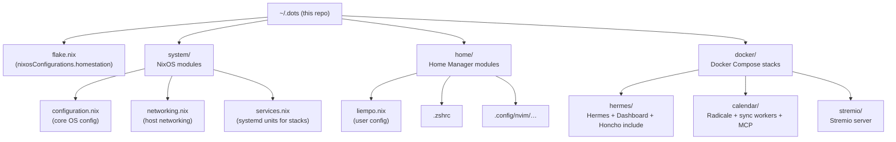
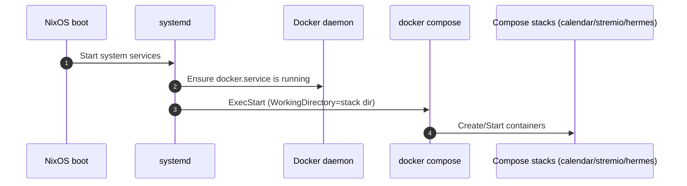
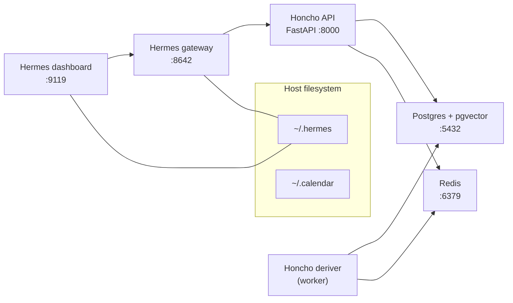
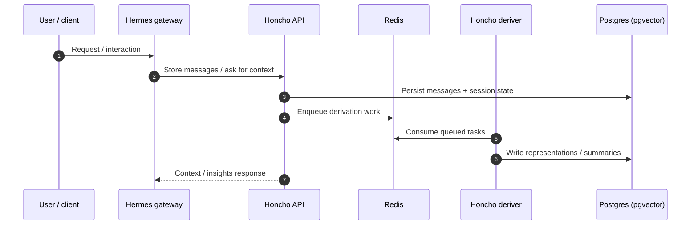
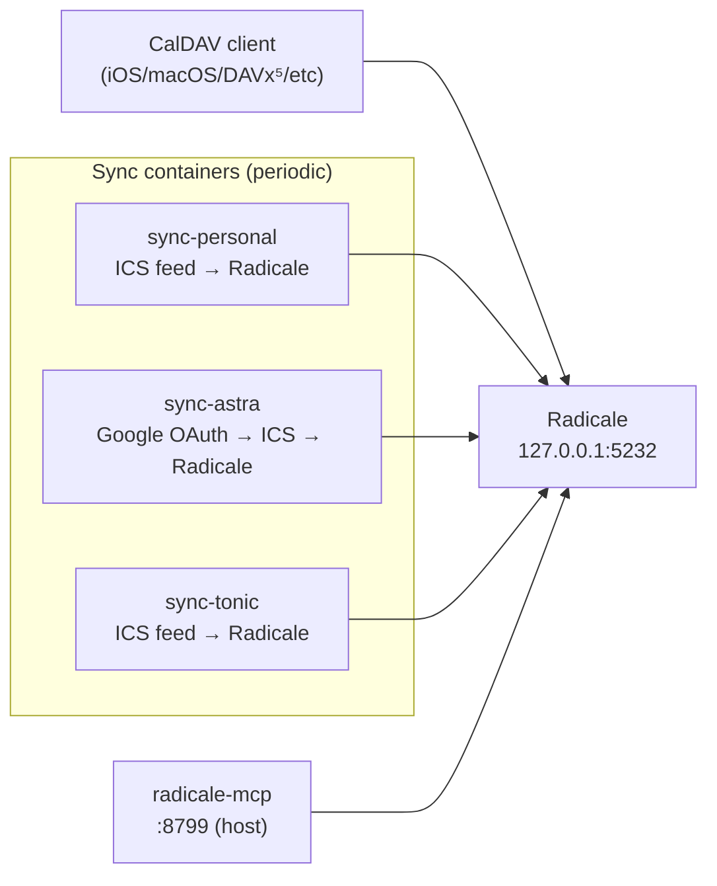
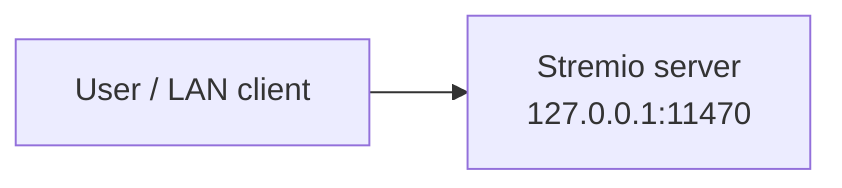

# Architecture

This repository is a **host configuration + self-hosted services** monorepo:

- **NixOS flake** defines a machine called **`homestation`**.
- **Home Manager** manages user-level dotfiles for `liempo`.
- **systemd services** start/stop several **Docker Compose stacks** under `docker/`.
- One stack (`docker/hermes/honcho/src`) is a **git submodule**: the upstream **Honcho** service.

---

## Repository map (high level)

---

## “Homestation” system architecture

### Control plane: NixOS + Home Manager

- **Flake entrypoint**: `flake.nix` defines `nixosConfigurations.homestation` and includes:
  - `system/configuration.nix`
  - `system/networking.nix`
  - `system/services.nix`
  - Home Manager (`home/liempo.nix`)
- **Networking**: `system/networking.nix` sets hostname, enables NetworkManager, enables Tailscale, and opens SSH (TCP/22).
- **User**: `liempo` is created in `system/configuration.nix` and put in the `docker` group.
- **Local dotfiles** are applied by Home Manager:
  - `~/.zshrc` is sourced from this repo.
  - Neovim config is sourced from `~/.config/nvim`.
  - Convenience scripts:
    - `update`: runs `sudo nixos-rebuild switch --flake "$HOME/.dots#homestation"`
    - `hermes`: runs the Hermes agent container interactively.

### Data plane: systemd-managed Docker Compose

`system/services.nix` defines one unit per stack:

- `calendar` → `docker compose up` in `docker/calendar`
- `stremio` → `docker compose up` in `docker/stremio`
- `hermes` → `docker compose up` in `docker/hermes`

This is the main operational contract: **NixOS boots → systemd starts Docker → systemd starts each Compose stack**.

---

## Docker stacks

### Hermes stack (`docker/hermes`)

`docker/hermes/compose.yaml` runs two containers and **includes** the Honcho stack:

- **`hermes`** (gateway)
  - Listens: `0.0.0.0:8642` (published as `8642:8642`)
  - Persistent host data: `~/.hermes:/opt/data`
  - Depends on `honcho_api` being started (from the included Honcho compose)
- **`dashboard`**
  - Listens: `0.0.0.0:9119` (published as `9119:9119`)
  - Reads gateway health via `GATEWAY_HEALTH_URL=http://hermes:8642`
  - Shares the same `~/.hermes` volume mount

#### Honcho as an included stack (submodule boundary)

`docker/hermes/honcho/compose.yaml` builds and runs **Honcho** (FastAPI + worker) plus data stores:

- **`honcho_api`**: FastAPI server (published to host as `127.0.0.1:8000`)
- **`honcho_deriver`**: background worker for representation/summary/dream tasks
- **`honcho_database`**: Postgres + pgvector (published to host as `127.0.0.1:5432`)
- **`honcho_redis`**: Redis (published to host as `127.0.0.1:6379`)

The Honcho application code lives in a git submodule:

- Submodule path: `docker/hermes/honcho/src`
- Upstream: `https://github.com/plastic-labs/honcho`

#### Key runtime flow (Hermes ↔ Honcho)

At runtime, the important relationship is:

- Hermes needs a **memory/insights backend** (Honcho) to store and retrieve long-term context.
- Honcho splits “API request handling” from “expensive derivations” via the `honcho_deriver` worker and Redis-backed queueing.

> For deep Honcho internals (peer/session primitives, agent roles, pipelines), see the submodule’s `docker/hermes/honcho/src/CLAUDE.md` and `docker/hermes/honcho/src/README.md`.

---

### Calendar stack (`docker/calendar`)

This stack provides a **local CalDAV server** (Radicale) plus one-or-more sync workers that publish `.ics` calendars into Radicale.

Services (from `docker/calendar/compose.yaml`):

- **`radicale`**
  - Listens: `127.0.0.1:5232`
  - Persistent host config/data:
    - `~/.calendar/radicale/etc:/radicale/etc`
    - `~/.calendar/radicale/var:/radicale/var`
- **`sync-*` containers** (examples: `sync-personal`, `sync-astra`, `sync-tonic`)
  - Build context: `docker/calendar/sync`
  - Input config: `/data/calendar.json` (mounted from `~/.calendar/data/<name>/calendar.json`)
  - Behavior: periodically generate/fetch ICS and upload into Radicale via HTTP `PUT`
- **`radicale-mcp`**
  - Exposes an MCP server over HTTP (published as `8799:8000`)
  - Connects to Radicale internally via `http://radicale:5232`

Operational details and setup steps live in `docker/calendar/README.md`.

---

### Stremio stack (`docker/stremio`)

This is a minimal single-service stack:

- **`stremio/server`**
  - Listens: `127.0.0.1:11470`
  - Environment: `NO_CORS=1`

---

## Ports and host bindings

The stacks are mostly bound to loopback for safety (except Hermes gateway/dashboard which are published on all interfaces in the compose file).

- **Hermes**
  - `8642/tcp` (host bind: `0.0.0.0:8642`)
  - `9119/tcp` (host bind: `0.0.0.0:9119`)
- **Honcho**
  - `8000/tcp` (host bind: `127.0.0.1:8000`)
  - `5432/tcp` (host bind: `127.0.0.1:5432`)
  - `6379/tcp` (host bind: `127.0.0.1:6379`)
- **Calendar**
  - `5232/tcp` (host bind: `127.0.0.1:5232`)
  - `8799/tcp` (host bind: `0.0.0.0:8799` from compose; adjust if you want loopback-only)
- **Stremio**
  - `11470/tcp` (host bind: `127.0.0.1:11470`)

---

## Source-of-truth files

- **NixOS entrypoint**: `flake.nix`
- **Core OS config**: `system/configuration.nix`
- **Systemd stack units**: `system/services.nix`
- **Home Manager user config**: `home/liempo.nix`
- **Compose stacks**:
  - `docker/hermes/compose.yaml`
  - `docker/hermes/honcho/compose.yaml`
  - `docker/calendar/compose.yaml`
  - `docker/stremio/compose.yaml`
- **Stack docs**:
  - `docker/calendar/README.md`
  - Honcho submodule docs: `docker/hermes/honcho/src/README.md`, `docker/hermes/honcho/src/CLAUDE.md`

