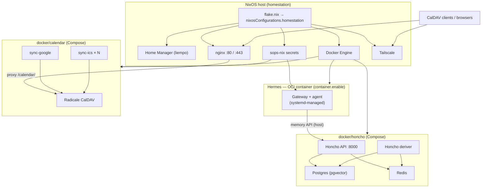

# Architecture

This repository is the **declarative configuration** for a home server (“homestation”): **NixOS** system state (including **sops-nix** secrets and the **Hermes** agent module), **Home Manager** user dotfiles, and **Docker** for workloads. **Calendar** and **Honcho** each run as **systemd** units (`calendar.service`, `honcho.service`) that wrap **Docker Compose** in `docker/calendar/` and `docker/honcho/`. The **calendar** stack reads env from **sops-nix** (`calendar-env` in `system/sops/secrets.yaml`); **Honcho** has no sops-backed env (optional local `docker/honcho/.env` if you need overrides). A **separate Hermes agent container** runs when `container.enable` is on.

**Hermes** is **not** one of those Compose stacks: it is declared by the upstream **`services.hermes-agent`** NixOS module (flake input `hermes-agent`) in `system/hermes/` (`config.yaml`, SOPS-backed env/auth). With **`container.enable = true`** (as in this repo), the module runs the agent as a **Docker/OCI container** on the host engine—**systemd** manages the unit. **Honcho** (memory API, Postgres, Redis) is **Compose-managed** under `docker/honcho/` and is reachable from that Hermes container via the host network so memory integration works.

**Clone with submodules** (Honcho source only; Hermes comes from the flake input, not a submodule):

`git clone --recurse-submodules <url> ~/.dots`

If you already cloned without submodules: `git submodule update --init --recursive`.

`.gitmodules` points at **`docker/honcho/src`** (HTTPS `plastic-labs/honcho`). To use SSH:  
`git config submodule.docker/honcho/src.url git@github.com:YOU/honcho.git`  
then `git submodule sync --recursive`.

## System overview

## Flake and NixOS

- **`flake.nix`** defines a single NixOS system: `nixosConfigurations.homestation` (`x86_64-linux`).
- **Inputs**: `nixpkgs` (25.11), `home-manager` (release matching nixpkgs), **`sops-nix`**, and **`hermes-agent`** (`github:NousResearch/hermes-agent`), with `follows` where noted so versions stay aligned.
- **Modules** (order of concern):
  - `system/hardware.nix` — hardware profile (disks, boot, CPU microcode).
  - `system/configuration.nix` — users, locale, OpenSSH, Docker, system packages, Zsh, autologin.
  - `system/networking.nix` — hostname, firewall, **Tailscale**, **nginx** virtual host, TLS via synced Tailscale certs.
  - **`sops-nix`** — `system/sops/sops.nix` (Hermes env/auth, plus **`calendar-env`** for the calendar Compose stack).
  - **`system/services.nix`** — **`honcho.service`** and **`calendar.service`** (`docker compose` per stack).
  - **`hermes-agent.nixosModules.default`** + **`system/hermes/hermes.nix`** — Hermes agent (containerized when `container.enable = true`).
  - `home-manager` as a NixOS submodule, user **`liempo`** → `home/liempo.nix`.

Rebuilding the machine from this repo:

`sudo nixos-rebuild switch --flake ~/.dots#homestation`

(see `home/.zshrc` for a convenience `update` alias).

## Home Manager (`home/`)

`home/liempo.nix` installs **user-level** programs and wires repo paths into the home directory:

- **`~/.zshrc`** ← `home/.zshrc`
- **tmux** extra config ← `home/.config/tmux/tmux.conf`
- **`~/.config/nvim`** ← `home/.config/nvim` (whole tree)

Paths are resolved relative to the Home Manager module file (`./.` == `home/`), so portable config lives under `home/` and is not duplicated in the Nix file content itself.

## Network edge

- **Tailscale** provides connectivity and machine DNS (e.g. `homestation.airplane-skilift.ts.net` in `system/networking.nix`).
- **nginx** terminates TLS using certificates copied from Tailscale’s cert directory into an nginx-readable location (`systemd` oneshot `tailscale-nginx-sync`).
- **Calendar exposure**: `https://<host>/calendar/` is reverse-proxied to **`127.0.0.1:5232`**, where the **Radicale** container binds locally. Well-known CalDAV/CardDAV paths redirect into the same prefix.

## Docker Compose stacks (`docker/` + systemd)

Each stack has its own **`compose.yaml`** under **`docker/calendar/`** and **`docker/honcho/`**. **NixOS** enables **`calendar.service`** and **`honcho.service`** (see **`system/services.nix`**): they run **`docker-compose -f compose.yaml up`** in the foreground (not **`-d`**) so container logs are attached to the unit and appear in **`journalctl -u honcho`** / **`journalctl -u calendar`**. **`calendar.service`** loads **`calendar-env`** from sops for compose `${RADICALE_*}` / `SYNC_INTERVAL_SECONDS`. **Honcho** uses compose defaults only unless you add a local (gitignored) **`docker/honcho/.env`**.

| Unit | Compose file | Secrets (sops) |
|------|----------------|----------------|
| `honcho.service` | `docker/honcho/compose.yaml` | none (optional local `.env`) |
| `calendar.service` | `docker/calendar/compose.yaml` | **`calendar-env`** → unit `EnvironmentFile` |

Manual control: `sudo systemctl start|stop|restart honcho` or `calendar`. To rebuild images after changing Dockerfiles: `cd ~/.dots/docker/honcho && docker compose build` (same for calendar), then restart the unit.

| Path | Role |
|------|------|
| `docker/calendar/` | **Radicale** (CalDAV) + **sync-google** (OAuth → Radicale) + **sync-ics** jobs (ICS URL → Radicale). Per-sync data under `data/` and `credentials/` (see `docker/calendar/README.md`). |
| `docker/honcho/` | **Honcho API** and **deriver** (build context **`src/`** submodule), **Postgres** (pgvector), **Redis**. API listens on **`0.0.0.0:8000`**; DB and Redis bind to **127.0.0.1** on the host (`5432`, `6379`). |

Stack-specific ignore rules live under `docker/*/.gitignore` where needed.

The **Hermes** agent container also uses this **Docker Engine** when **`container.enable`** is set; it is **not** a service in these Compose files—see **Hermes (NixOS module)** below.

## Hermes (NixOS module)

Hermes is enabled via **`services.hermes-agent`** in `system/hermes/hermes.nix`: **`configFile`** points at `system/hermes/config.yaml`, and **`environmentFiles`** / **`authFile`** come from **SOPS** secrets.

**`container.enable = true`** runs the agent on the **host Docker** as an **OCI** image: the NixOS module generates **systemd** units that create/run that container (it is **not** defined in the calendar/honcho Compose files). **`container.image`** selects the base image (e.g. `hermes-agent:local`); **`container.hostUsers`** maps host users/groups into the container when needed.

Custom **baked** images (extra tools in the filesystem) are documented in **`docker/hermes/README.md`**.

## Data and trust boundaries

- **On disk in git**: Nix modules under `system/` and `home/`, `docker/**` Compose definitions and non-secret templates, submodule source trees as tracked.
- **On disk but not in git**: SOPS key material and secret files (see repo `.gitignore` and `secrets/`), calendar OAuth and data under `docker/calendar/`, Honcho `.env` and named volumes, Radicale `var`, Hermes runtime state managed by the NixOS module, TLS material under Tailscale paths (nginx only copies published certs).

## Related documentation

- Calendar stack: `docker/calendar/README.md`
- Honcho (submodule): `docker/honcho/src/README.md`
- Hermes custom image: `docker/hermes/README.md`
- Hermes agent (flake input / upstream): [NousResearch/hermes-agent](https://github.com/NousResearch/hermes-agent)

## Todo

- Fix Hermes dashboard to run as a systemd service along with the Hermes gateway.
