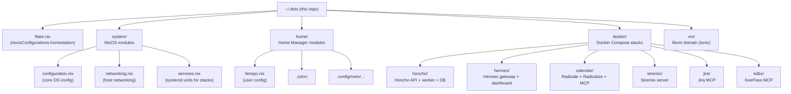
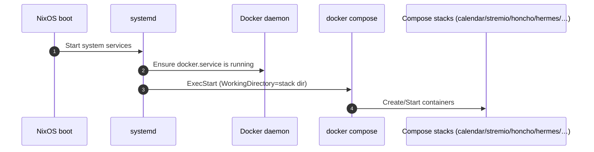
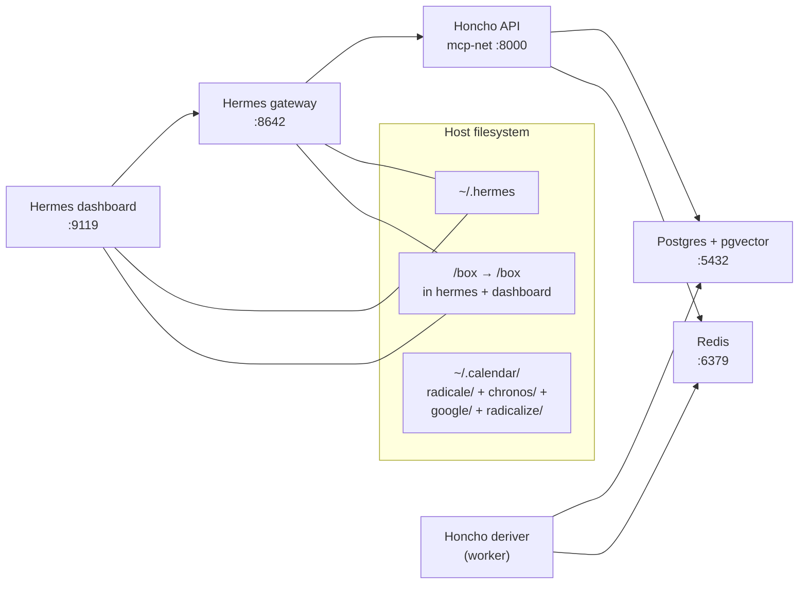
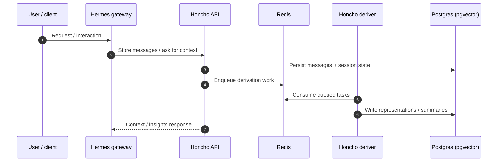
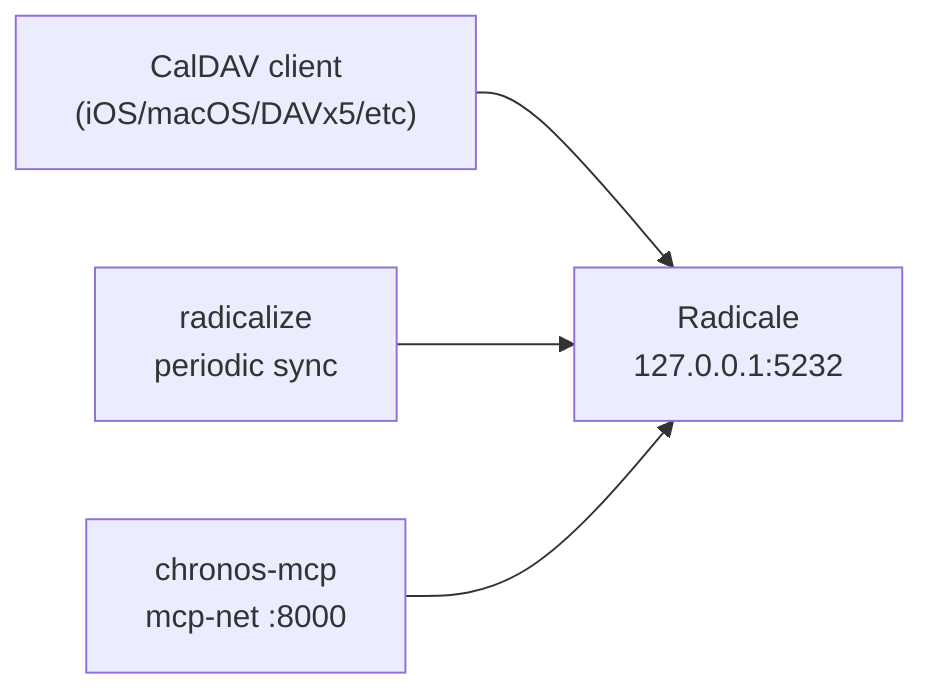
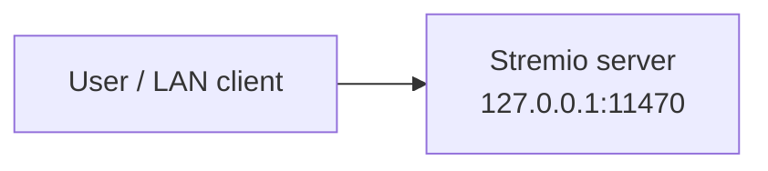

# Liempo’s homelab

**`~/.dots`** is Liempo’s declarative homelab: one headless **NixOS** host (**homestation**) where OS settings, user **`liempo`**’s dotfiles, and background apps are kept in this repo and applied with **`nixos-rebuild`** and **Home Manager**.

**How things connect:** **`flake.nix`** pulls in **`system/`** (networking, storage, **Samba**, **libvirt**, **nginx** for **`tonic`** Playwright proxy, **systemd** units) and **`home/liempo.nix`**. **systemd** starts **Docker Compose** trees under **`docker/`** on boot. Stacks attach to shared Docker network **`mcp-net`** so **Hermes**, **Honcho**, Chronos, Jira MCP, KDBX MCP, and friends resolve each other by container DNS (for example **`http://honcho_api:8000`**). Heavy workspace data sits on **`/box`** (mounted disk, exposed via SMB); Hermes bind-mounts **`/box`**. Per-stack state uses **`~`** paths such as **`~/.hermes`** and **`~/.calendar`** (Radicale **`radicale/etc`**, **`radicale/var`**, **`radicale/.env`**, Chronos **`chronos/`**, Google OAuth **`google/oauth.json`**, Radicalize **`radicalize/`**). For host bind ports vs **`mcp-net`**-only services, see **`docker/README.md`**.

---

# Architecture

This repository is a **host configuration + self-hosted services** monorepo:

- **NixOS flake** defines a machine called **`homestation`**.
- **Home Manager** manages user-level dotfiles for `liempo`.
- **systemd services** start/stop several **Docker Compose stacks** under `docker/`.
- **`docker/honcho/src`** is a **git submodule**: the upstream **Honcho** application.
- **`docker/calendar/radicalize`** is a **git submodule**: **[Radicalize](https://github.com/liempo/radicalize)** (Compose builds the image from this path).

After clone, run **`git submodule update --init --recursive`**, or clone with **`--recurse-submodules`**.

---

## Repository map (high level)

---

## “Homestation” system architecture

### Control plane: NixOS + Home Manager

- **Flake entrypoint**: `flake.nix` defines `nixosConfigurations.homestation` and includes:
  - `system/configuration.nix`
  - `system/networking.nix`
  - `system/services.nix`
  - Home Manager (`home/liempo.nix`)
- **Networking**: `system/networking.nix` sets hostname, enables NetworkManager, enables Tailscale, and opens SSH (TCP/22).
- **User**: `liempo` is created in `system/configuration.nix` and put in the `docker` group.
- **Local dotfiles** are applied by Home Manager:
  - `~/.zshrc` is sourced from this repo.
  - Neovim config is sourced from `~/.config/nvim`.
  - Convenience scripts:
    - `update`: runs `sudo nixos-rebuild switch --flake "$HOME/.dots#homestation"`
    - `hermes`: runs the Hermes agent container interactively.

### Data plane: systemd-managed Docker Compose

`system/services.nix` defines one unit per stack:

- `calendar` → `docker compose up` in `docker/calendar`
- `stremio` → `docker compose up` in `docker/stremio`
- `honcho` → `docker compose up` in `docker/honcho`
- `hermes` → `docker compose up` in `docker/hermes` (starts after **`honcho`**)
- `jira` → `docker compose up` in `docker/jira`
- `kdbx` → `docker compose up` in `docker/kdbx`

This is the main operational contract: **NixOS boots → systemd starts Docker → systemd starts each Compose stack**.

### VM (`vm/`)

Homestation runs one Windows guest, **`tonic`** (**Windows 11 IoT Enterprise LTSC**), under **KVM/libvirt**. It carries the corporate VPN and browser access to internal **`tonic.com.au`** sites so the headless NixOS host does not run that workload. **`system/libvirt.nix`** reserves a stable NAT address for the guest; **`system/nginx.nix`** exposes **Playwright** on the guest to the rest of the machine via a reverse proxy. The libvirt domain is tracked as **`vm/tonic.xml`**.

More detail (purpose, DHCP constants, regenerating **`tonic.xml`**, **`virsh define`**): **`vm/README.md`**.

---

## Docker stacks

### Honcho stack (`docker/honcho`)

`docker/honcho/compose.yaml` builds and runs **Honcho** (FastAPI + worker) plus data stores:

- **`honcho_api`**: FastAPI server on **`mcp-net`** as **`honcho_api:8000`** (no host port publish)
- **`honcho_deriver`**: background worker for representation/summary/dream tasks
- **`honcho_database`**: Postgres + pgvector (Compose network only; **`honcho_database:5432`**)
- **`honcho_redis`**: Redis (Compose network only; **`honcho_redis:6379`**)

Application source is a git submodule:

- Submodule path: `docker/honcho/src`
- Upstream: `https://github.com/plastic-labs/honcho`

---

### Hermes stack (`docker/hermes`)

`docker/hermes/compose.yaml` runs the gateway and dashboard only (separate Compose project from Honcho):

- **`hermes`** (gateway)
  - Listens: `0.0.0.0:8642` (published as `8642:8642`)
  - Persistent host data: `~/.hermes:/opt/data`
  - Attached to **`mcp-net`** so it can reach **`honcho_api`** by container DNS name
- **`dashboard`**
  - Listens: `0.0.0.0:9119` (published as `9119:9119`)
  - Reads gateway health via `GATEWAY_HEALTH_URL=http://hermes:8642`
  - Shares the same `~/.hermes` volume mount

Both **`hermes`** and **`dashboard`** bind-mount the host **`/box`** volume at **`/box`** in the container (`/box:/box` in `docker/hermes/compose.yaml`). On NixOS, `/box` is the mounted disk partition (`fileSystems."/box"` in `system/configuration.nix`). **`hermes.service`** waits for **`box.mount`** and **`honcho.service`** (`system/services.nix`).

#### Key runtime flow (Hermes ↔ Honcho)

At runtime, the important relationship is:

- Hermes needs a **memory/insights backend** (Honcho) to store and retrieve long-term context.
- Honcho splits “API request handling” from “expensive derivations” via the `honcho_deriver` worker and Redis-backed queueing.

> For deep Honcho internals (peer/session primitives, agent roles, pipelines), see the submodule’s `docker/honcho/src/CLAUDE.md` and `docker/honcho/src/README.md`.

---

### Calendar stack (`docker/calendar`)

This stack provides a **local CalDAV server** ([Radicale](https://radicale.org/)), **[Radicalize](https://github.com/liempo/radicalize)** to merge Google Calendar / ICS / CalDAV sources into Radicale, and **Chronos MCP** for agents on **`mcp-net`**.

Radicalize application source is a git submodule:

- Submodule path: **`docker/calendar/radicalize`**
- Remote (see **`.gitmodules`**): **`git@github.com.personal:liempo/radicalize.git`**

Services (from `docker/calendar/compose.yaml`):

- **`radicale`**
  - Listens: `127.0.0.1:5232`
  - Persistent host config/data: **`~/.calendar/radicale/etc`**, **`~/.calendar/radicale/var`**
- **`radicalize`**
  - Image built from **`docker/calendar/radicalize`** (submodule checkout)
  - Host data dir: **`~/.calendar/radicalize`** (sources/tokens from Radicalize); OAuth client JSON at **`~/.calendar/google/oauth.json`** (SOPS) bind-mounted as **`credentials/google-oauth-client.json`** in the container
  - Image entrypoint **`chown`**s the data dir then drops to **`RADICALIZED_UID:GID`** (**`calendar.service`** exports **`RADICALIZED_UID`** / **`RADICALIZED_GID`** for **`liempo:users`**, matching [liempo/radicalize](https://github.com/liempo/radicalize))
  - If **`~/.calendar/radicalize`** was already created as **root**, run **`sudo chown -R "$USER":users ~/.calendar/radicalize`** once before the next Home Manager / **`nixos-rebuild switch`**
  - Reads **`~/.calendar/radicale/.env`** (same **`RADICALE_*`** / **`SYNC_*`** as Compose) mounted into the container data dir
- **`chronos-mcp`**
  - Runs [Chronos MCP](https://github.com/democratize-technology/chronos-mcp) (FastMCP) with **streamable HTTP** on container port **8000**, attached to **`mcp-net`** (e.g. `http://chronos-mcp:8000/mcp`)
  - **`env_file`**: **`~/.calendar/radicale/.env`**; mounts **`~/.calendar/chronos/accounts.json`** → **`/root/.chronos/accounts.json`** for [multi-account](https://github.com/democratize-technology/chronos-mcp#configuration) entries

Secrets and host paths are documented in **`docker/calendar/README.md`**. **`mcp-net`** exposure summary: **`docker/README.md`**.

---

### Stremio stack (`docker/stremio`)

This is a minimal single-service stack:

- **`stremio/server`**
  - Listens: `127.0.0.1:11470`
  - Environment: `NO_CORS=1`

---

## Ports and host bindings

The stacks are mostly bound to loopback for safety (except Hermes gateway/dashboard which are published on all interfaces in the compose file).

- **Hermes**
  - `8642/tcp` (host bind: `0.0.0.0:8642`)
  - `9119/tcp` (host bind: `0.0.0.0:9119`)
- **Honcho**: no host publishes; **`honcho_api`** on **`mcp-net`** (container **8000**); Postgres/Redis only inside the Honcho Compose network
- **Calendar**
  - `5232/tcp` (host bind: `127.0.0.1:5232`)
  - **`chronos-mcp`** / **`radicalize`**: no host publish; **`mcp-net`** only (Chronos **8000**)
- **Stremio**
  - `11470/tcp` (host bind: `127.0.0.1:11470`)
- **Jira MCP / KDBX MCP**
  - No host publishes; **`mcp-net`** only (see `docker/README.md`)

---

## Source-of-truth files

- **Overview & architecture** (this file): `README.md`
- **NixOS entrypoint**: `flake.nix`
- **Core OS config**: `system/configuration.nix`
- **Libvirt / DHCP for `tonic`**: `system/libvirt.nix`
- **`tonic` VM domain XML & rebuild notes**: `vm/README.md`, `vm/tonic.xml`
- **Nginx reverse proxy (`tonic` Playwright)**: `system/nginx.nix`
- **Systemd stack units**: `system/services.nix`
- **Home Manager user config**: `home/liempo.nix`
- **Compose stacks**:
  - `docker/honcho/compose.yaml`
  - `docker/hermes/compose.yaml`
  - `docker/calendar/compose.yaml`
  - `docker/stremio/compose.yaml`
  - `docker/jira/compose.yaml`
  - `docker/kdbx/compose.yaml`
- **Stack docs**:
  - `docker/README.md` (per-service host / **`mcp-net`** exposure)
  - `docker/calendar/README.md`, `docker/honcho/README.md`, `docker/hermes/README.md`, `docker/jira/README.md`, `docker/kdbx/README.md`, `docker/stremio/README.md`
  - Honcho submodule docs: `docker/honcho/src/README.md`, `docker/honcho/src/CLAUDE.md`
