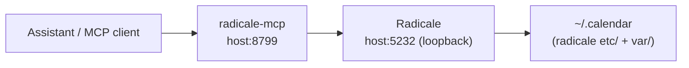

## What this repo is

- **Host config**: NixOS flake for `homestation` + Home Manager for user `liempo`.
- **Services**: systemd-managed Docker Compose stacks under `docker/`.

If you need the big-picture topology, read `ARCHITECTURE.md` first.

---

## Current MCP integrations (enabled today)

### Calendar MCP: `radicale-mcp`

**Purpose**: exposes a CalDAV-backed MCP server that talks to the local Radicale server.

**Where it lives**: `docker/calendar/compose.yaml` as the `radicale-mcp` service.

**How it’s deployed**:

- Radicale runs at `127.0.0.1:5232` on the host (loopback-only).
- `radicale-mcp` runs in Docker and is exposed on the host at port **`8799`** (container port `8000`).
- Inside the Compose network it reaches Radicale via `http://radicale:5232`.

**Topology**



#### Configuration

The Calendar stack reads environment variables from:

- `docker/calendar/.env` (local, do not commit secrets)
- `docker/calendar/.env.example` (template)

Key variables used by `radicale-mcp` (from `compose.yaml`):

- `RADICALE_USER`
- `RADICALE_PASSWORD`

> Security note: don’t paste or commit real credentials. Treat `.env` as secret material.

#### Operational notes

`radicale-mcp` installs the server at container startup:

- Base image: `python:3.12-slim`
- Installs from Git: `git+https://github.com/TheGreatGooo/radicale-mcp.git`
- Runs an HTTP transport MCP server on `0.0.0.0:8000` (inside container)

This means:

- **First startup can be slow** (apt + pip install).
- Restarts re-run installation unless the image is rebuilt/cached by your environment.

#### Start / restart (Docker Compose)

From the stack directory:

```bash
cd docker/calendar
docker compose up -d
```

To rebuild the sync worker image(s) (not strictly needed for `radicale-mcp` since it’s not built from a Dockerfile here):

```bash
cd docker/calendar
docker compose up -d --build
```

#### Quick verification

From the host, confirm the port is reachable:

```bash
curl -sS "http://127.0.0.1:8799" || true
```

Exact endpoints depend on the upstream `radicale-mcp` implementation; if you need to harden this verification, inspect the upstream project and pin a known health endpoint.

---

## TODO

### Tonic MCPs

- [ ] Add QA testing MCP (**needs to be set up in a virtual machine**)
- [ ] Add JIRA ticket MCP (**readonly**)

### Astra MCPs

- [ ] Add Basecamp MCP

### Editor integration

- [ ] Integrate Hermes into Zed editor

