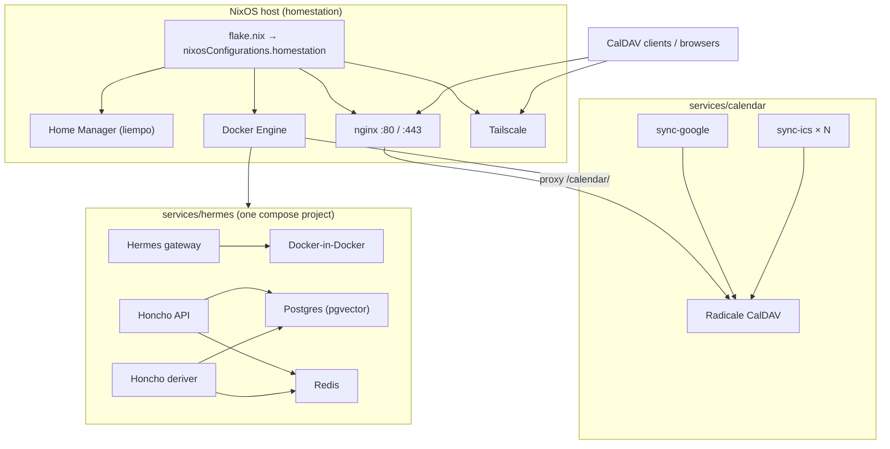

# Architecture

This repository is the **declarative configuration** for a home server (“homestation”): **NixOS** system state, **Home Manager** user dotfiles, and **Docker Compose** stacks for long-running services. The flake ties the machine and user config together; services are deployed separately with Compose on the host’s Docker.

**Clone with submodules** (Hermes agent source and Honcho, including Hermes’s nested `tinker-atropos`):

`git clone --recurse-submodules <url> ~/.dots`

If you already cloned without submodules: `git submodule update --init --recursive`.

`.gitmodules` uses HTTPS (`liempo/hermes-agent`, `plastic-labs/honcho`). To use your own SSH remote for Hermes, run  
`git config submodule.services/hermes/core-src.url git@github.com:YOU/hermes-agent.git`  
(then `git submodule sync --recursive`).

## System overview



## Flake and NixOS

- **`flake.nix`** defines a single NixOS system: `nixosConfigurations.homestation` (`x86_64-linux`).
- **Inputs**: `nixpkgs` (25.11) and `home-manager` (release matching nixpkgs), with `follows` to keep versions aligned.
- **Modules** (in order of concern):
  - `nixos/hardware.nix` — generated hardware profile (disks, boot, CPU microcode).
  - `nixos/configuration.nix` — users, locale, OpenSSH, Docker, system packages, Zsh, autologin.
  - `nixos/networking.nix` — hostname, firewall, **Tailscale**, **nginx** virtual host, TLS via synced Tailscale certs.
  - `home-manager` as a NixOS submodule, user **`liempo`** → `home/liempo.nix`.

Rebuilding the machine from this repo is done with the flake attribute, for example:

`sudo nixos-rebuild switch --flake ~/.dots#homestation`

(see `home/.zshrc` for a convenience alias).

## Home Manager (`home/`)

`home/liempo.nix` installs **user-level** programs and wires repo paths into the home directory:

- **`~/.zshrc`** ← `home/.zshrc`
- **tmux** extra config ← `home/.config/tmux/tmux.conf`
- **`~/.config/nvim`** ← `home/.config/nvim` (whole tree)

Paths are resolved relative to the Home Manager module file (`./.` == `home/`), so portable config lives under `home/` and is not duplicated in the Nix file content itself.

## Network edge

- **Tailscale** provides connectivity and machine DNS (e.g. `homestation.airplane-skilift.ts.net` in `networking.nix`).
- **nginx** terminates TLS using certificates copied from Tailscale’s cert directory into an nginx-readable location (`systemd` oneshot `tailscale-nginx-sync`).
- **Calendar exposure**: `https://<host>/calendar/` is reverse-proxied to **`127.0.0.1:5232`**, where the **Radicale** container binds locally. Well-known CalDAV/CardDAV paths redirect into the same prefix.

## Docker services (`services/`)

Compose files are **per stack**, not a single root compose project:

| Directory | Role |
|-----------|------|
| `services/calendar/` | **Radicale** (CalDAV) + **sync-google** (OAuth → Radicale) + **sync-ics** jobs (ICS URL → Radicale). Env and per-sync JSON configs live under `data/` and `credentials/` (see `services/calendar/README.md`). |
| `services/hermes/` | One **`compose.yaml`**: **Hermes** (`gateway run`, build `core-src`) talks to **Docker-in-Docker** over TLS (`DOCKER_HOST` → `docker:2376`, client certs from shared `dind-certs` volume). **Honcho** runs in the same project: **`honcho_api`** / **`honcho_deriver`** (build `honcho-src`), **`honcho_database`** (pgvector), **`honcho_redis`**. API/db/redis publish to **127.0.0.1** on the host (`8000`, `5432`, `6379`). Hermes state under `./data` → `/opt/data` (mostly gitignored via `services/.gitignore`). Optional Honcho env: `honcho-src/.env`. |

**`services/.gitignore`** documents which paths are secrets or runtime data (`.env`, calendar credentials/data, Radicale `var`, Hermes data, etc.) so the repository stays declarative where possible.

All containers in `services/hermes/compose.yaml` attach to the **default Compose network**, so Hermes can call Honcho by service name (e.g. `honcho_api:8000`) where the agent config points to it.

## Hermes (NixOS module) custom container image

If you are using the Hermes Agent NixOS module with `services.hermes-agent.container.enable = true`, you can bake extra tools into the base OCI image (so they survive container recreation when the identity hash changes).

Build the custom image from this repo:

```bash
docker build -t hermes-agent:local -f system/hermes/Dockerfile system/hermes
```

Then point the NixOS module at it:

- `services.hermes-agent.container.image = "hermes-agent:local";`

Note: the NixOS module still uses its own entrypoint (`/data/current-entrypoint`); the custom image is used as the base filesystem layer.

## Data and trust boundaries

- **On disk in git**: Nix modules, editor/shell config under `home/`, Compose definitions, sync scripts/Dockerfiles, non-secret Radicale `etc` templates.
- **On disk but not in git**: OAuth tokens, Radicale user password files, Hermes data under `services/hermes/data`, Honcho `honcho-src/.env` and named volumes at runtime, TLS material under Tailscale’s paths (nginx only copies published certs).

## Related documentation

- Calendar stack details: `services/calendar/README.md`
- Hermes agent (git submodule): `services/hermes/core-src/README.md`
- Honcho (git submodule): `services/hermes/honcho-src/README.md`
