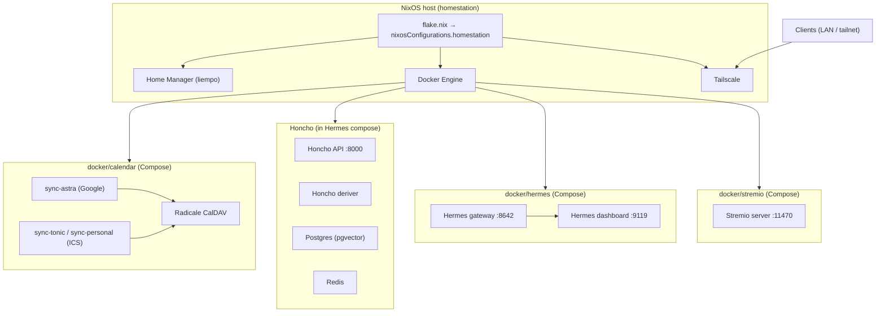

# Architecture

This repository is the **declarative configuration** for a home server (“homestation”): **NixOS** system state, **Home Manager** user dotfiles, and **Docker Compose** workloads. **Calendar**, **Stremio**, and **Hermes** run as **systemd** units (`calendar.service`, `stremio.service`, `hermes.service`) wrapping Compose in `docker/calendar/`, `docker/stremio/`, and `docker/hermes/`. **Honcho** (API, deriver, Postgres, Redis) is **included** via `docker/hermes/honcho/compose.yaml`, not a separate unit. Secrets are typically **local** `.env` files next to each compose file (gitignored) or Hermes state under `~/.hermes`—see `SECRETS.md`. A `system/sops/` tree exists for optional **sops-nix** integration but is **not** wired into the current `flake.nix`.

**Clone with submodules** (Honcho API source only):

`git clone --recurse-submodules <url> ~/.dots`

If you already cloned without submodules: `git submodule update --init --recursive`.

`.gitmodules` points at **`docker/hermes/honcho/src`** (HTTPS `plastic-labs/honcho`). To use SSH:  
`git config submodule.docker/hermes/honcho/src.url git@github.com:YOU/honcho.git`  
then `git submodule sync --recursive`.

## System overview

Compose binds app ports to **127.0.0.1** on the host. For tailnet access (HTTPS, `svc:...`, etc.), see `TAILSCALE.md`.

## Flake and NixOS

- **`flake.nix`** defines a single NixOS system: `nixosConfigurations.homestation` (`x86_64-linux`).
- **Inputs**: `nixpkgs` (`nixos-25.11`) and `home-manager` (`release-25.11`, follows `nixpkgs`).
- **Modules** (as imported in the flake):
  - `system/hardware.nix` — hardware profile (disks, boot, CPU microcode).
  - `system/configuration.nix` — users, locale, OpenSSH, Docker, system packages, Zsh, autologin.
  - `system/networking.nix` — hostname, firewall, **Tailscale**.
  - **`system/services.nix`** — **`calendar.service`**, **`stremio.service`**, and **`hermes.service`** (`docker compose` per stack; no Tailscale Serve hooks).
  - `home-manager` as a NixOS submodule, user **`liempo`** → `home/liempo.nix`.

Rebuilding the machine from this repo:

`sudo nixos-rebuild switch --flake ~/.dots#homestation`

(see `home/.zshrc` for a convenience `update` alias).

## Home Manager (`home/`)

`home/liempo.nix` installs **user-level** programs and wires repo paths into the home directory:

- **`~/.zshrc`** ← `home/.zshrc`
- **tmux** extra config ← `home/.config/tmux/tmux.conf`
- **`~/.config/nvim`** ← `home/.config/nvim` (whole tree)

Paths are resolved relative to the Home Manager module file (`./.` == `home/`), so portable config lives under `home/` and is not duplicated in the Nix file content itself.

## Tailscale

This repo enables Tailscale on the host (`system/networking.nix`) but does **not** declaratively manage **Serve** / **Services** bindings. See `TAILSCALE.md` for the full setup and troubleshooting guide.

## Services and ports

**Firewall (from `system/networking.nix`):** TCP **22** (SSH).

### systemd → Compose

| Unit | Working directory | Compose file |
|------|-------------------|--------------|
| `calendar.service` | `docker/calendar/` | `compose.yaml` |
| `stremio.service` | `docker/stremio/` | `compose.yaml` |
| `hermes.service` | `docker/hermes/` | `compose.yaml` (includes `honcho/compose.yaml`) |

### Published host ports (Docker → container)

| Host | Container | Service | Notes |
|------|-----------|---------|--------|
| `127.0.0.1:5232` | 5232 | Radicale | CalDAV (tailnet HTTPS via Tailscale Serve: see `TAILSCALE.md`). |
| `127.0.0.1:11470` | 11470 | Stremio | Streaming server (tailnet HTTPS via Tailscale Serve: see `TAILSCALE.md`). |
| `127.0.0.1:8000` | 8000 | Honcho API | Included in Hermes stack; optional local `docker/hermes/honcho/.env` (tailnet HTTPS via Tailscale Serve: see `TAILSCALE.md`). |
| `127.0.0.1:5432` | 5432 | Honcho Postgres | pgvector image. |
| `127.0.0.1:6379` | 6379 | Honcho Redis | |
| `127.0.0.1:8642` | 8642 | Hermes gateway | Gateway API (tailnet HTTPS via Tailscale Serve: see `TAILSCALE.md`). |
| `127.0.0.1:9119` | 9119 | Hermes dashboard | Dashboard (tailnet HTTPS via Tailscale Serve: see `TAILSCALE.md`). |

Sync containers (**sync-astra**, **sync-tonic**, **sync-personal**) and **honcho_deriver** do not publish host ports. **sync-astra** OAuth uses port **8090** only when you run the one-off auth command with that port published (see `docker/calendar/README.md`).

## Docker Compose stacks (`docker/` + systemd)

Each stack has its own **`compose.yaml`**. **NixOS** enables **`calendar.service`**, **`stremio.service`**, and **`hermes.service`** (see **`system/services.nix`**): they run **`docker-compose -f compose.yaml up --remove-orphans`** in the foreground (not **`-d`**) so container logs are attached to the unit and appear in **`journalctl -u calendar`**, **`journalctl -u stremio`**, and **`journalctl -u hermes`**.

| Unit | Compose file | Env / secrets |
|------|----------------|---------------|
| `calendar.service` | `docker/calendar/compose.yaml` | **`docker/calendar/.env`** for Radicale credentials and sync interval |
| `stremio.service` | `docker/stremio/compose.yaml` | Optional; **`NO_CORS=1`** in compose |
| `hermes.service` | `docker/hermes/compose.yaml` | Hermes data under **`~/.hermes`**; optional **`docker/hermes/honcho/.env`** for Honcho |

Manual control: `sudo systemctl start|stop|restart calendar` (same for **`stremio`** and **`hermes`**). To rebuild images after changing Dockerfiles: `cd ~/.dots/docker/hermes && docker compose build` (same pattern for other stacks), then restart the unit.

| Path | Role |
|------|------|
| `docker/calendar/` | **Radicale** (CalDAV) + **sync-astra** (Google OAuth → Radicale) + **sync-tonic** / **sync-personal** (ICS → Radicale). Per-sync data under `data/` and `credentials/` (see `docker/calendar/README.md`). |
| `docker/stremio/` | **Stremio** streaming server image `stremio/server:latest`. |
| `docker/hermes/` | **Hermes** gateway + dashboard; **`include`** pulls in **`docker/hermes/honcho/`** (Honcho API, deriver, Postgres, Redis). Honcho source build context: **`docker/hermes/honcho/src`** (submodule). |
| `docker/hermes/honcho/` | Honcho **compose fragment** (not run as its own systemd unit). |

Stack-specific ignore rules live under `docker/*/.gitignore` where needed.

## Hermes (Docker Compose)

Hermes runs as **`hermes.service`** with **`docker/hermes/compose.yaml`**: **gateway** (`gateway run`) and **dashboard** services sharing **`~/.hermes`** for agent data. This replaces a separate NixOS **`services.hermes-agent`** module in older layouts; configuration follows the upstream image defaults plus data under **`~/.hermes`**.

**Caveats:**

- **`~/.hermes`** on the host is not writable by **`liempo`**; only the **`hermes`** user or **root** can change files there (match ownership to how the unit runs or use **`sudo`** when editing).
- Do **not** set **`HERMES_UID`** and **`HERMES_GID`** in **`docker/hermes/compose.yaml`**. Doing so breaks the **dashboard** (it fails to build / start).

## Data and trust boundaries

- **On disk in git**: Nix modules under `system/` and `home/`, `docker/**` Compose definitions and non-secret templates, submodule source trees as tracked.
- **On disk but not in git**: Local `.env` files, calendar OAuth and data under `docker/calendar/`, Honcho `.env` and named volumes, Radicale `var`, Hermes state under `~/.hermes`, Tailscale state (including HTTPS for Serve).

## Related documentation

- Calendar stack: `docker/calendar/README.md`
- Honcho upstream (submodule): `docker/hermes/honcho/src/README.md`
- Local env layout: `SECRETS.md`
- Upstream Hermes agent images: [NousResearch/hermes-agent](https://github.com/NousResearch/hermes-agent)
