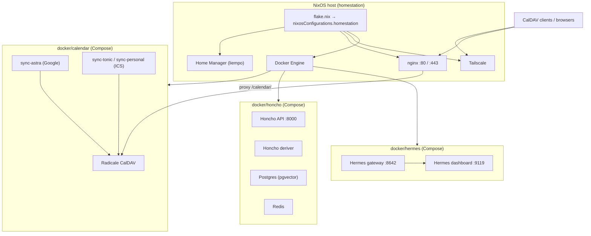

# Architecture

This repository is the **declarative configuration** for a home server (“homestation”): **NixOS** system state, **Home Manager** user dotfiles, and **Docker Compose** workloads. **Honcho**, **Calendar**, and **Hermes** each run as **systemd** units (`honcho.service`, `calendar.service`, `hermes.service`) that wrap **Docker Compose** in `docker/honcho/`, `docker/calendar/`, and `docker/hermes/`. Secrets are typically **local** `.env` files next to each compose file (gitignored) or Hermes state under `~/.hermes`—see `SECRETS.md`. A `system/sops/` tree exists for optional **sops-nix** integration but is **not** wired into the current `flake.nix`.

**Clone with submodules** (Honcho API source only):

`git clone --recurse-submodules <url> ~/.dots`

If you already cloned without submodules: `git submodule update --init --recursive`.

`.gitmodules` points at **`docker/honcho/src`** (HTTPS `plastic-labs/honcho`). To use SSH:  
`git config submodule.docker/honcho/src.url git@github.com:YOU/honcho.git`  
then `git submodule sync --recursive`.

## System overview

## Flake and NixOS

- **`flake.nix`** defines a single NixOS system: `nixosConfigurations.homestation` (`x86_64-linux`).
- **Inputs**: `nixpkgs` (`nixos-25.11`) and `home-manager` (`release-25.11`, follows `nixpkgs`).
- **Modules** (as imported in the flake):
  - `system/hardware.nix` — hardware profile (disks, boot, CPU microcode).
  - `system/configuration.nix` — users, locale, OpenSSH, Docker, system packages, Zsh, autologin.
  - `system/networking.nix` — hostname, firewall, **Tailscale**, **nginx** virtual host, TLS via synced Tailscale certs.
  - **`system/services.nix`** — **`honcho.service`**, **`calendar.service`**, and **`hermes.service`** (`docker compose` per stack).
  - `home-manager` as a NixOS submodule, user **`liempo`** → `home/liempo.nix`.

Rebuilding the machine from this repo:

`sudo nixos-rebuild switch --flake ~/.dots#homestation`

(see `home/.zshrc` for a convenience `update` alias).

## Home Manager (`home/`)

`home/liempo.nix` installs **user-level** programs and wires repo paths into the home directory:

- **`~/.zshrc`** ← `home/.zshrc`
- **tmux** extra config ← `home/.config/tmux/tmux.conf`
- **`~/.config/nvim`** ← `home/.config/nvim` (whole tree)

Paths are resolved relative to the Home Manager module file (`./.` == `home/`), so portable config lives under `home/` and is not duplicated in the Nix file content itself.

## Network edge

- **Tailscale** provides connectivity and machine DNS (e.g. `homestation.airplane-skilift.ts.net` in `system/networking.nix`).
- **nginx** terminates TLS using certificates copied from Tailscale’s cert directory into an nginx-readable location (`systemd` oneshot `tailscale-nginx-sync`).
- **Calendar exposure**: `https://<host>/calendar/` is reverse-proxied to **`127.0.0.1:5232`**, where the **Radicale** container binds locally. Well-known CalDAV/CardDAV paths redirect into the same prefix.

## Docker Compose stacks (`docker/` + systemd)

Each stack has its own **`compose.yaml`**. **NixOS** enables **`honcho.service`**, **`calendar.service`**, and **`hermes.service`** (see **`system/services.nix`**): they run **`docker-compose -f compose.yaml up --remove-orphans`** in the foreground (not **`-d`**) so container logs are attached to the unit and appear in **`journalctl -u honcho`**, **`journalctl -u calendar`**, and **`journalctl -u hermes`**.

| Unit | Compose file | Env / secrets |
|------|----------------|---------------|
| `honcho.service` | `docker/honcho/compose.yaml` | Optional local **`docker/honcho/.env`** |
| `calendar.service` | `docker/calendar/compose.yaml` | **`docker/calendar/.env`** for Radicale credentials and sync interval |
| `hermes.service` | `docker/hermes/compose.yaml` | Hermes data under **`~/.hermes`** |

Manual control: `sudo systemctl start|stop|restart honcho` (same for `calendar` and `hermes`). To rebuild images after changing Dockerfiles: `cd ~/.dots/docker/honcho && docker compose build` (same pattern for calendar), then restart the unit.

| Path | Role |
|------|------|
| `docker/calendar/` | **Radicale** (CalDAV) + **sync-astra** (Google OAuth → Radicale) + **sync-tonic** / **sync-personal** (ICS → Radicale). Per-sync data under `data/` and `credentials/` (see `docker/calendar/README.md`). |
| `docker/honcho/` | **Honcho API** and **deriver** (build context **`src/`** submodule), **Postgres** (pgvector), **Redis**. API listens on **`0.0.0.0:8000`**; DB and Redis bind to **127.0.0.1** on the host (`5432`, `6379`). |
| `docker/hermes/` | **Hermes** gateway and dashboard images (`nousresearch/hermes-agent`), ports **8642** (gateway) and **9119** (dashboard). |

Stack-specific ignore rules live under `docker/*/.gitignore` where needed.

## Hermes (Docker Compose)

Hermes runs as **`hermes.service`** with **`docker/hermes/compose.yaml`**: **gateway** (`gateway run`) and **dashboard** services sharing **`~/.hermes`** for agent data. This replaces a separate NixOS **`services.hermes-agent`** module in older layouts; configuration follows the upstream image defaults plus data under **`~/.hermes`**.

## Data and trust boundaries

- **On disk in git**: Nix modules under `system/` and `home/`, `docker/**` Compose definitions and non-secret templates, submodule source trees as tracked.
- **On disk but not in git**: Local `.env` files, calendar OAuth and data under `docker/calendar/`, Honcho `.env` and named volumes, Radicale `var`, Hermes state under `~/.hermes`, TLS material under Tailscale paths (nginx only copies published certs).

## Related documentation

- Calendar stack: `docker/calendar/README.md`
- Honcho stack (this repo): `docker/honcho/README.md`
- Honcho upstream (submodule): `docker/honcho/src/README.md`
- Local env layout: `SECRETS.md`
- Upstream Hermes agent images: [NousResearch/hermes-agent](https://github.com/NousResearch/hermes-agent)
